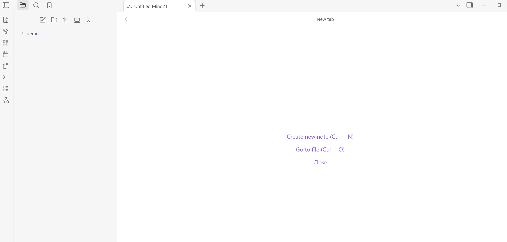
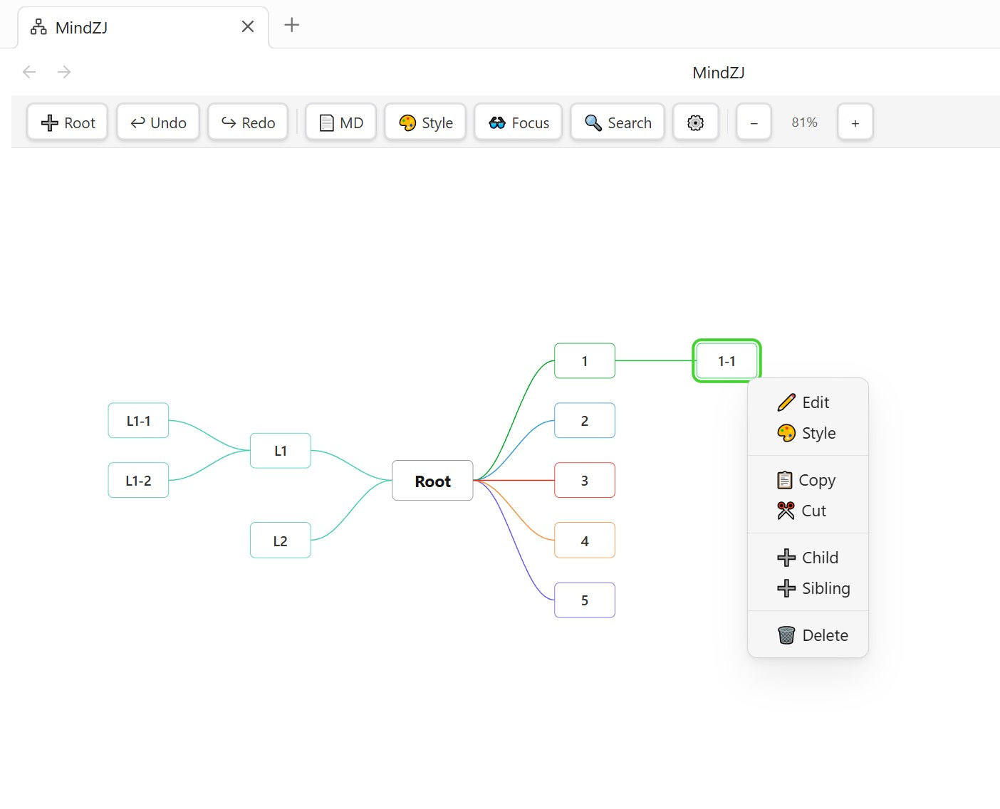
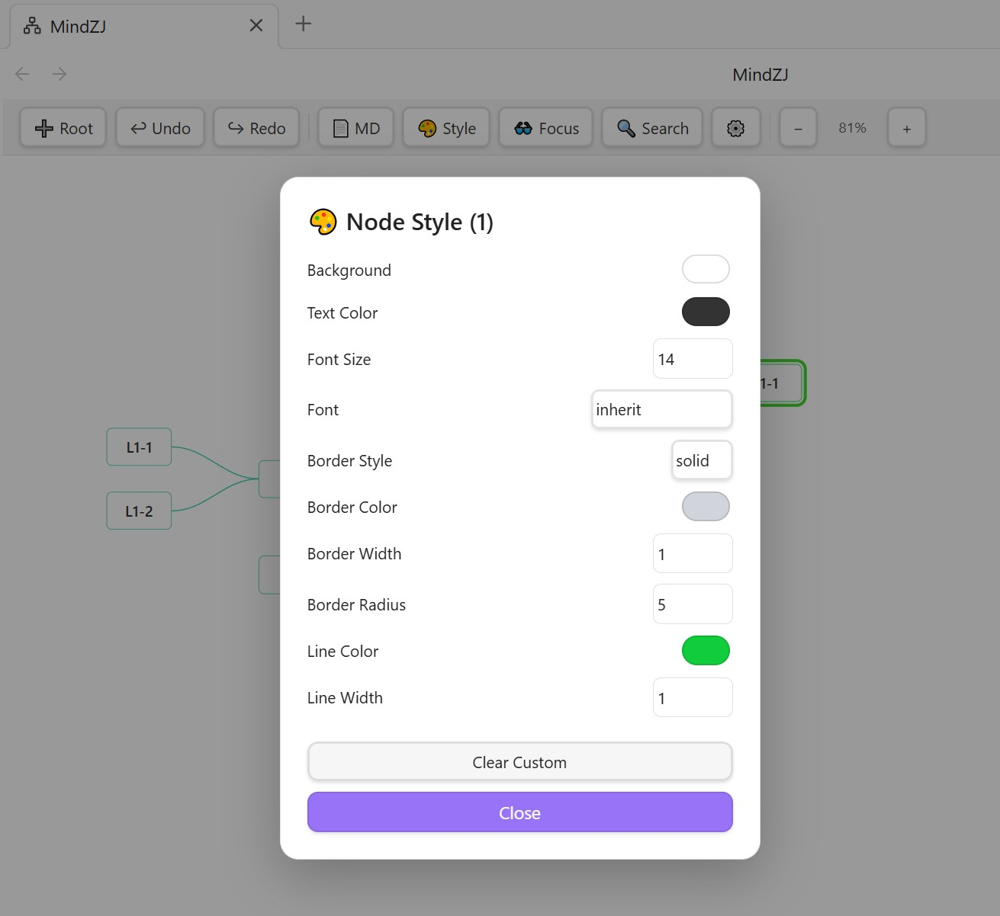

<h1 align="center">
  <span style="font-size:58px;">🗺️</span>
</h1>

<h1 align="center">MindZJ — Obsidian マインドマッププラグイン</h1>

<p align="center">
  <em><a href="https://obsidian.md">Obsidian</a> 向けに開発された、高機能でフルカスタマイズ可能なマインドマッププラグイン。</em>
</p>

<p align="center">
  <a href="#機能">機能</a> •
  <a href="#インストール">インストール</a> •
  <a href="#クイックスタート">クイックスタート</a> •
  <a href="#キーボードショートカット">ショートカット</a> •
  <a href="#カスタマイズ">カスタマイズ</a> •
  <a href="#開発">開発</a> •
  <a href="#ライセンス">ライセンス</a>
</p>

<p align="center">
  
  
  
  
</p>

<p align="center">
  <strong>🌐 他の言語：</strong>
  <a href="../README.md">English</a> |
  <a href="README_ZH.md">中文</a> |
  <a href="README_JA.md">日本語</a> |
  <a href="README_FR.md">Français</a> |
  <a href="README_DE.md">Deutsch</a> |
  <a href="README_ES.md">Español</a>
</p>

---

<p align="center">
  <a href="https://www.buymeacoffee.com/superjohn">
    
  </a>
  &nbsp;
  <a href="https://ko-fi.com/superjohn">
    
  </a>
  &nbsp;
  <a href="https://paypal.me/TanCat997">
    
  </a>
</p>

<p align="center">MindZJ が役に立ったら、プロジェクトの支援をご検討ください</p>

---

## プレビュー

<p align="center">
  
  <br/>
  <em>ノード作成、テキスト編集、ドラッグ＆ドロップ、レインボー接続線のデモ</em>
</p>

<p align="center">
  
  <br/>
  <em>MindZJ メインインターフェース — Obsidian 内でマインドマップを直接作成・編集・スタイリング</em>
</p>

<p align="center">
  
  <br/>
  <em>グローバルスタイルパネル — マインドマップのあらゆる視覚要素を細かく調整</em>
</p>

---

## 機能

### コア機能

- **ネイティブ `.mindzj` ファイル形式** — Vault 内にファイルを保存し、Obsidian のファイルシステムと完全統合
- **無制限のルートノード** — 1つのキャンバスに複数の独立した思考ツリーを作成可能
- **双方向レイアウト** — 子ノードをルートの右側、左側、または両側に配置
- **Markdown モード** — ビジュアルマップビューと Markdown テキスト編集を自由に切り替え
- **元に戻す / やり直す** — 安心して操作できる完全な履歴スタック

### 編集機能

- **インライン編集** — ダブルクリックまたは Space キーでノードをその場で編集
- **キー入力で編集** — ノード選択中にキーを押すだけで編集モードに移行
- **複数行対応** — Shift+Enter でノード内の改行が可能
- **キーボード中心のワークフロー** — Enter で兄弟ノード追加、Tab で子ノード追加、矢印キーでナビゲーション
- **複数選択** — Shift/Ctrl クリックまたはボックス選択で複数ノードを一括操作
- **コピー / カット / ペースト** — ノードツリーの完全なクリップボード対応（ファイル間のペーストも可能）
- **作成時に編集** — 新しいノード作成時にすぐ編集モードに入るオプション

### ビジュアル

- **6種類の接続線スタイル** — ベジエ曲線、直線、カーブ、ステップ、ブラケット、ルーズ
- **9種類の内蔵レインボーパレット** — クラシック、パステル、ネオン、アース、オーシャン、サンセット、フォレスト、キャンディ、モノクローム
- **カスタムレインボーパレット** — 接続線用に最大12色のカスタム配色を定義可能
- **ノード別スタイル上書き** — 個々のノードの背景色、文字色、フォント、枠線、角丸を変更
- **ノード別の接続線色・幅** — 任意の分岐でグローバル接続線色を上書き
- **10種類のフォント** — システムフォント、セリフ、サンセリフ、等幅フォントを含む
- **5種類の枠線スタイル** — 実線、破線、点線、二重線、なし
- **キャンバス背景色** — テーマに合わせたり、カスタム背景色を設定

### インタラクション

- **ドラッグ＆ドロップ** — ドラッグで兄弟の順序変更やノードの親変更が可能
- **ルートノードのドラッグ** — キャンバス上でルートノードを自由に配置
- **ズーム＆パン** — スクロールでパン、Shift+スクロールまたはピンチでズーム、方向反転設定対応
- **ノードフォーカス** — `F` キーで選択中のノードをビューポートの中心に表示
- **検索** — Ctrl+F で全ノードをテキスト検索、結果のハイライトとナビゲーション対応

### ツールバーとスタイルパネル

- **カスタマイズ可能なツールバー** — 位置（上部/下部）、パディング、背景色、ボタンの色と枠線スタイル
- **専用スタイルパネル** — 右側パネルに折りたたみ式セクションで全スタイル設定を整理
- **マップ内スタイルモーダル** — キャンバス右クリック → グローバルスタイルでマップを離れずに素早く調整
- **ツールバーの表示/非表示** — 設定、右クリックメニュー、またはスタイルパネルから切り替え

### 国際化

- **19言語対応** — English、中文、日本語、Français、Deutsch、Español、Русский、Svenska、हिन्दी、한국어、Português、Suomi、Norsk、Nederlands、Liechtensteinisch、Dansk、עברית、Italiano、العربية
- **カスタムノード名** — 言語ごとにデフォルトの「ルート」「子ノード」ラベルを変更可能

### 設定

- **完全カスタマイズ可能なキーボードショートカット** — ビジュアルキーレコーダーですべてのアクションをリバインド
- **スクロール＆ズームの反転** — 垂直スクロール、水平スクロール、ズーム方向の独立切り替え
- **開発者モード** — 内部状態のオーバーレイ表示（選択、パン、ズーム、ノード数）

---

## インストール

### Obsidian コミュニティプラグインからインストール（推奨）

> _近日公開予定 — プラグインは現在開発中です。_

1. **設定 → コミュニティプラグイン → 閲覧** を開く
2. **MindZJ** を検索
3. **インストール** をクリックし、**有効化** する

### 手動インストール

1. [GitHub Releases](https://github.com/zjok/mindzj/releases) から最新の `main.js` と `manifest.json` をダウンロード
2. Vault 内にフォルダを作成：`.obsidian/plugins/mindzj/`
3. `main.js` と `manifest.json` をそのフォルダにコピー
4. Obsidian を再起動し、設定 → コミュニティプラグイン で **MindZJ** を有効化

---

## クイックスタート

1. 左リボンの **🗺️ ネットワークアイコン** をクリック、またはコマンド **「New MindZJ」** を実行
2. 新しい `.mindzj` ファイルが作成され、マップビューで開く
3. ノードを**ダブルクリック**するか **Space** キーを押してテキストを編集
4. **Tab** で子ノード追加、**Enter** で兄弟ノード追加
5. キャンバスを右クリックでグローバルスタイルモーダルを開く、またはツールバーの 🎨 **スタイル** でスタイルパネルを表示

<p align="center">
  
  <br/>
  <em>30秒以内でゼロからスタイル付きマインドマップを作成</em>
</p>

---

## キーボードショートカット

すべてのショートカットは 設定 → MindZJ → キーボードショートカット で変更可能です。

| 操作               | デフォルトショートカット        |
| ------------------ | ------------------------------- |
| ノードを編集       | `Space または Ctrl + Enter`     |
| 兄弟ノード追加     | `Enter`                         |
| 子ノード追加       | `Tab`                           |
| 左子ノード追加     | `Shift + Tab`                   |
| ノードにフォーカス | `F`                             |
| 元に戻す           | `Ctrl + Z`                      |
| やり直す           | `Ctrl + Shift + Z`              |
| ノード検索         | `Ctrl + F`                      |
| ノードをコピー     | `Ctrl + C`                      |
| ノードをカット     | `Ctrl + X`                      |
| ノードをペースト   | `Ctrl + V`                      |
| ノードを削除       | `Delete` / `Backspace`          |
| ナビゲーション     | `↑` `↓` `←` `→`                 |
| 改行（編集中）     | `Shift + Enter`                 |
| 拡大               | `Shift + =`                     |
| 縮小               | `Shift + -`                     |
| ズームリセット     | `Shift + 0`                     |
| キャンバス移動     | `Space` 長押し + マウスドラッグ |

---

## カスタマイズ

### グローバルスタイル

グローバルスタイルパネルは、すべてのノードと接続線のデフォルト外観を制御します。アクセス方法：

- **ツールバー** → 🎨 スタイルボタン → 右側パネルを表示
- **キャンバス右クリック** → 🎨 全体スタイル → マップ内モーダルを表示
- **設定** → MindZJ → 基本スタイルオプション（キャンバス背景、テーマ）

利用可能なスタイルオプション：

| カテゴリ         | プロパティ                                                                              |
| ---------------- | --------------------------------------------------------------------------------------- |
| **子ノード**     | 背景色、文字色、フォントサイズ、フォント、枠線（スタイル/色/幅/角丸）、最小幅、最小高さ |
| **ルートノード** | 子ノードと同様、独立したデフォルト値                                                    |
| **接続線**       | スタイル（6種類）、色、幅、長さ、方向、レインボー切替とパレット                         |
| **選択**         | 選択枠の色、幅、オフセット；編集枠の色と幅                                              |
| **テキスト**     | 配置（左/中央/右）、パディング、行の高さ                                                |
| **キャンバス**   | 背景色                                                                                  |
| **ツールバー**   | 位置、パディング（上/右/下/左）、背景色、ボタンの背景色/枠線/文字色                     |

### ノード別スタイル

任意のノードを右クリック → 🎨 スタイル で個別の外観を上書き：

- 背景色、文字色、フォントサイズ、フォント
- 枠線スタイル、色、幅、角丸
- 接続線の色と幅（そのノードにつながる分岐の接続線）

### レインボー接続線

レインボーモードを有効にすると、各分岐が自動的に異なる色で着色されます。9種類の内蔵パレットから選択するか、最大12色のカスタムパレットを定義できます。

---

## ファイル形式

MindZJ は独自の `.mindzj` ファイル拡張子を使用します。ファイル内容はプレーン JSON です：

```json
{
    "rootNodes": [
        {
            "id": "uuid",
            "text": "ルート",
            "x": 0,
            "y": 0,
            "width": 100,
            "height": 44,
            "children": [
                {
                    "id": "uuid",
                    "text": "子ノード",
                    "x": 0,
                    "y": 0,
                    "width": 80,
                    "height": 32,
                    "children": []
                }
            ],
            "isRoot": true
        }
    ]
}
```

ファイルは人間が読める形式で、バージョン管理に適しています。Obsidian Sync、iCloud、Git、その他のファイルベースの同期ツールでシームレスにデバイス間同期できます。

---

## 開発

### 前提条件

- [Node.js](https://nodejs.org/) 16+
- npm

### セットアップ

```bash
git clone https://github.com/zjok/mindzj.git
cd mindzj
npm install
```

### ビルド

```bash
# 開発モード（ウォッチモード — ファイル変更時に自動再ビルド）
npm run dev

# プロダクションモード（1回ビルド、ソースマップなし、ツリーシェイキング済み）
npm run build
```

### プロジェクト構成

```
mindzj/
├── src/
│   ├── main.ts            # プラグインエントリポイント、コマンド、ライフサイクル
│   ├── MindMapView.ts     # コアマインドマップビュー：レンダリング、編集、インタラクション
│   ├── StylePanelView.ts  # 右側スタイルパネルビュー
│   ├── SettingsTab.ts     # プラグイン設定タブ
│   ├── types.ts           # TypeScript インターフェース、デフォルト値、定数
│   └── i18n.ts            # 19言語翻訳システム
├── manifest.json          # Obsidian プラグインマニフェスト
├── package.json           # npm 依存関係とスクリプト
├── tsconfig.json          # TypeScript 設定
├── esbuild.config.mjs     # ビルド設定
└── main.js                # コンパイル済み出力（自動生成）
```

### 技術スタック

- **TypeScript** — 信頼性のための厳密な型付け
- **esbuild** — ツリーシェイキングによる高速バンドル
- **SVG + foreignObject**

## サポート

MindZJ が役に立ったら、プロジェクトの支援をご検討ください：

<p align="center">
  <a href="https://www.buymeacoffee.com/username">
    
  </a>
  &nbsp;
  <a href="https://ko-fi.com/username">
    
  </a>
  &nbsp;
  <a href="https://paypal.me/username">
    
  </a>
</p>

---

## ライセンス

このプロジェクトは [GNU Affero 一般公衆利用許諾 v3.0](LICENSE)（AGPL-3.0-or-later）の下でライセンスされています。

---

<p align="center">
  <strong>SuperJohn</strong> が ❤️ を込めて開発 2026.03
</p>
